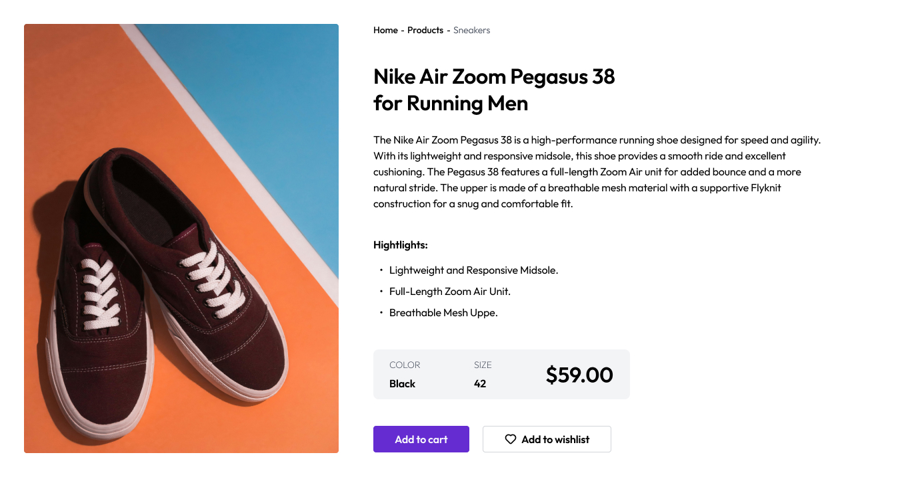
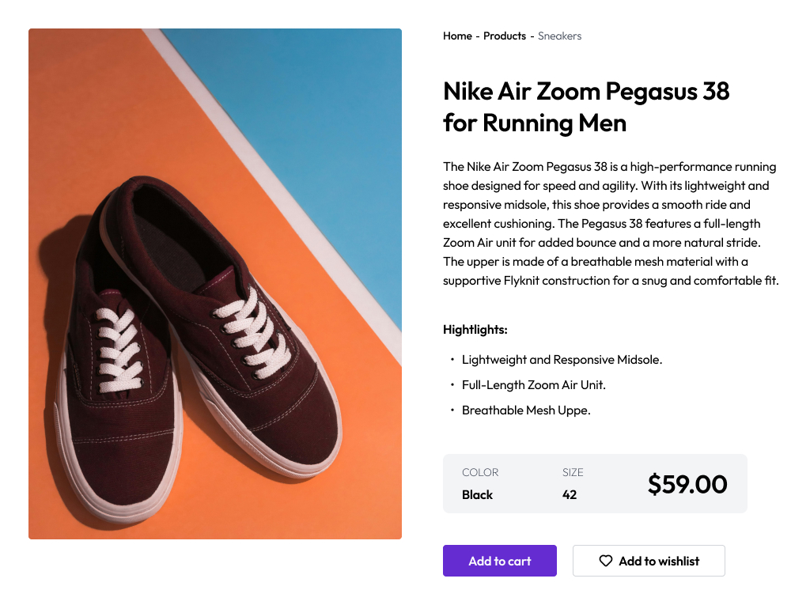
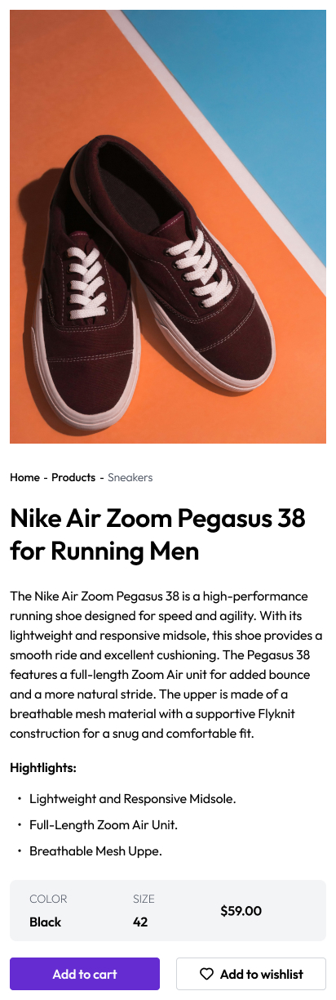

# DevChallenges.io - Simple Product Page

  

## 📋 Overview

This project is a pixel-perfect solution to the [Simple Product Page](https://devchallenges.io/challenge/simple-product-page-challenge) challenge from [devChallenges.io](https://devchallenges.io/). The goal was to create a fully responsive, accessible, and visually accurate article listing page using only HTML and CSS, closely matching the provided design for all screen sizes.

| Desktop | Tablet | Mobile |
| ------- | ------ | ------ |
|  |  |  |

## 🚀 Features

- Fully responsive web page that displays on different devices and screen sizes.
- Clean, semantic, accessible webpage and user-friendly
- Standard mobile first design practice
- Optimized local images for fast loading
- No frameworks

## 🛠️ Built With

- HTML5
- CSS3 (no frameworks)

## 📦 Getting Started

1. Clone or download this repository.
2. Open `index.html` in your browser.
3. All assets are local; no build step is required.

## 🧠 What I Learned

- How to compress local images from `.jpeg` to `avif` to optimize web perfomance and loading speed
- Advanced responsive layout techniques with flexbox and media queries
- In creating the web page for tablet and desktop devices using flexbox:

**i**. I grouped the webpage into two columns as show in the design; image and contents so that `.container` has only 2 direct children. This made it easy to style the layout in 2-columns.

**ii.** I understood that if i had 2-columns side by side, then i need exactly two direct children in flexbox to make it work & if the items are more than two, then wrap them in `divs` so that they are grouped in just two

## 🙏 Acknowledgements

- [devChallenges.io](https://devchallenges.io/) for the challenge and assets
- [Squoosh](https://squoosh.app/) to compress and convert images
- 

Design system:

Palette: Deep navy #1D3461 primary · warm off-white #F9F7F3 ground · amber #C17F37 accent
Fonts: Libre Baskerville (display serif headings) + Outfit (clean body sans) + DM Mono (labels/tags)
